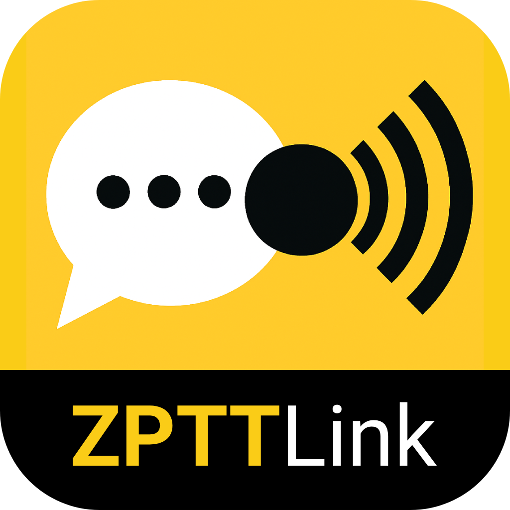

<p align="center">
  
</p>

<p align="center">
  <a href="https://www.python.org/">
    
  </a>
  <a href="https://opensource.org/licenses/MIT">
    
  </a>
  
</p>

ZPTTLink
========

ZPTTLink is an open-source, cross-platform application that bridges Zello (running inside BlueStacks) with radio gateway hardware like the AIOC (All-In-One Cable): https://github.com/skuep/AIOC. It enables seamless Push-to-Talk (PTT) control and audio routing, allowing users to link RF radios to Zello using only a desktop computer.

This tool is ideal for GMRS and ham radio operators, emergency communications volunteers, and hobbyists who want to build a software-based radio gateway.

Features
--------

- Compatible with AIOC, CM108-based, and other USB serial/audio radio cables
- Detects PTT signals via USB serial
- Simulates keypresses or mouse events to trigger Zello’s Push-to-Talk
- Cross-platform support for Windows and macOS
- Minimal and simple (KISS — no GUI required)
- Audio routing via VB-Cable (Windows) or BlackHole (macOS)

Requirements
------------

- AIOC or compatible USB PTT/audio interface
- Python 3.8 or newer
- Zello installed inside BlueStacks
- Virtual audio driver:
  - VB-Cable: https://vb-audio.com/Cable/
  - BlackHole: https://existential.audio/blackhole/

Installation and Setup
----------------------

1. Install Python:
   - Windows: https://www.python.org/downloads/windows
   - macOS: Use Homebrew with:
     ```
     brew install python
     ```

2. Install virtual audio driver:
   - Windows: Install VB-Cable from https://vb-audio.com/Cable/
   - macOS: Install BlackHole from https://existential.audio/blackhole/

3. Clone the repository:
git clone https://github.com/maxhayim/ZPTTLink.git
cd ZPTTLink

4. Create and activate a virtual environment:
- Windows:
  ```
  python -m venv venv
  venv\Scripts\activate
  ```
- macOS:
  ```
  python3 -m venv venv
  source venv/bin/activate
  ```

5. Install dependencies:
pip install -r requirements.txt

Usage
-----

1. Activate your virtual environment:
source venv/bin/activate

2. Run ZPTTLink:
python -m zpttlink

3. Once running, you can use:
- `help` — Displays available commands and usage information
- `q` or `quit` — Safely exits the program

4. Launch Zello inside BlueStacks:
- Assign the same hotkey in Zello (e.g., F8 or F9)
- Select the virtual audio driver as the microphone input

5. Press the PTT button on your radio cable (e.g., AIOC).  
ZPTTLink will detect it, simulate a keypress, and Zello will transmit your audio.

How It Works
------------

ZPTTLink listens to the USB serial signal from your radio cable. When activated, it simulates a keypress or mouse event to trigger Zello in BlueStacks. Audio from your radio is routed using the virtual audio driver, creating a seamless RF-to-Zello link.

License
-------

MIT License

Contributing
------------

Pull requests are welcome. Open an issue first to discuss ideas or report bugs.

Related Projects
----------------

AIOC - All-In-One Cable for Ham Radio: https://github.com/skuep/AIOC

Acknowledgments
---------------

Portions of this project are based on or inspired by the AIOC project by skuep (https://github.com/skuep/AIOC).  
Zello® for Android is a trademark of Zello Inc., Android™ is a trademark of Google LLC, and both are used here solely for interoperability purposes.  All other trademarks are the property of their respective owners.
